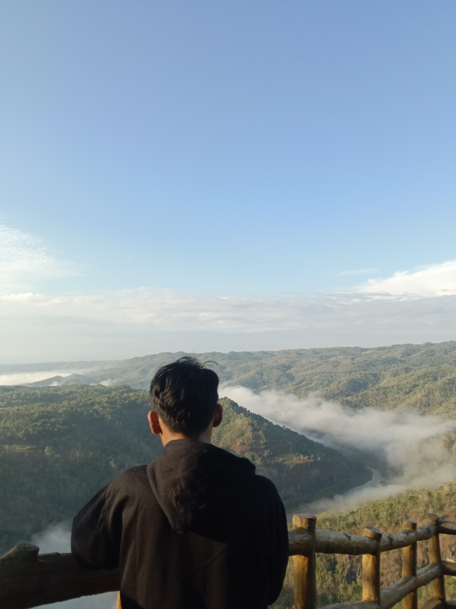

<html lang="id">
<head>
    <meta charset="UTF-8">
    <meta name="viewport" content="width=device-width, initial-scale=1.0">
    <title>CV - Kusnul irvan affandi</title>
    
</head>
<body>

    

        
        

            <h1>nama anda</h1>
            
Email: ipan3445@email.com 
            Telepon: 0817 0160 2785 
            Alamat: wijrejo pandak bantul

        

    

    

        <h3>Ringkasan Profil</h3>
        
Saya adalah seorang profesional di bidang RPL, memiliki pengalaman lebih dari 3 tahun dalam industri ini. Memiliki keahlian dalam RPL dan mampu bekerja secara individu maupun dalam tim.

    

    

        <h3>Pendidikan</h3>
        <ul>
            <li><strong>SMK Negeri 1 Sanden</strong>, RPL, 2024 - 2027</li>
            <li><strong>SMP Negeri 3 pandak</strong>, 2021 - 2024</li>
            <li><strong>SD 2 wijirejo</strong>, 2015 - 2021</li>
        </ul>
    

    

        <h3>Keahlian</h3>
        <ul>
            <li>PHP & MySQL</li>
            <li>Laravel</li>
            <li>HTML, CSS, JavaScript</li>
            <li>Git & GitHub</li>
        </ul>
    

    

        <h3>Bahasa</h3>
        <ul>
            <li>Bahasa Indonesia (Lancar)</li>
            <li>Bahasa Inggris (Menengah)</li>
        </ul>
    

</body>
</html>
